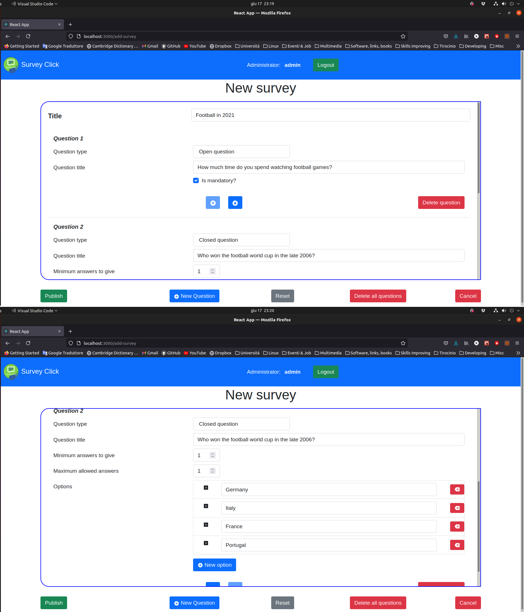

# Exam #1234: "Survey Click"
## Student: s292459 Ruggeri Giuseppe 

## React Client Application Routes

- Route `/` or `/surveys`:
  - <b><i>If not authenticated</i></b>: the page shows the list of all published surveys in a table, you can click on a survey and start responding to the clicked survey
  - <b><i>If authenticated</i></b>: the page shows the list of the logged-in admin's surveys in a table, you can click on a survey and start viewing the first response to the survey
- Route `/surveys/:surveyId`:
  - <b><i>If not authenticated</i></b>: the page shows a form in order to allow the user to respond to the survey referenced by the <b><i>surveyId</i></b>, the user can submit his response or cancel and go back to the homepage (<b><i>/suverys</i></b>)
  - <b><i>If authenticated</i></b>: it's a shortcut made for convenience, it shows the exact same page of <b><i>/surveys/:surveyId/survey-replies/:firstReplyId</i></b>
- Route `/surveys/:surveyId/survey-replies/:replyId`:
  - <b><i>If not authenticated</i></b>: the user is redirected to the homepage <b><i>/surveys</i></b>
  - <b><i>If authenticated</i></b>: the page shows a read-only form with the response identified by <b><i>replyId</i></b> to the survey referenced by the <b><i>surveyId</i></b>, the admin can click on two arrow buttons to move back and forward (changing the path) through the responses, or he can click to a cancel button to go back to the homepage
- Route `/surveys/:surveyId/survey-replies`: it's a shortcut made for convenience, it shows the exact same page of <b><i>/surveys/:surveyId/survey-replies/:firstReplyId</i></b>
- Route `/add-survey`: the page shows a form for creating a new survey creating and managing the questions, it also provides some buttons for publishing the survey, reset or cancel and back to the homepage.
- Route `others paths`: the page shows <b>404 not found</b>

## API Server

- GET `/api/surveys` - send back the list of surveys plus (if authenticated) the replies identifiers
  - request: no request parameters and the request body content is empty
  - response: the response body will contain a json object (if success):
    - <b><i>If authenticated</i></b>:\
    {\
      &nbsp;&nbsp;&nbsp;&nbsp;surveys: an array of objects {id, title, admin_id},\
      &nbsp;&nbsp;&nbsp;&nbsp;allSurveyReplies: an array of objects {surveyId, count: the count of replies, replyIds: an array with the reply identifiers}\
    }
    - <b><i>If not authenticated</i></b>: an array of objects {id, title, admin_id}
    - in case of error: empty response body (header status: 500)

- GET `/api/surveys/:surveyId` - send back the requested survey with associated questions
  - request: <b><i>surveyId</i></b> - the identifier of the survey that the client wants to fetch
  - response: the response body will contain a json object (if success):
    - <b><i>If authenticated</i></b>:\
    {\
      &nbsp;&nbsp;&nbsp;&nbsp;survey:\
      &nbsp;&nbsp;&nbsp;&nbsp;{\
      &nbsp;&nbsp;&nbsp;&nbsp;&nbsp;&nbsp;&nbsp;&nbsp;survey: {id, title, admin_id}\
      &nbsp;&nbsp;&nbsp;&nbsp;&nbsp;&nbsp;&nbsp;&nbsp;surveyReplies: {survey_id, count, replyIds}\
    &nbsp;&nbsp;&nbsp;&nbsp;},\
      &nbsp;&nbsp;&nbsp;&nbsp;questions: array of objects {id, survey_id, title, type, min, max, ordering_position},\
      &nbsp;&nbsp;&nbsp;&nbsp;allClosedChoices: an array of objects {id, question_id, content} of all closed choices in all the closed questions in the survey\
    }
    - <b><i>If not authenticated</i></b>:\
    {\
      &nbsp;&nbsp;&nbsp;&nbsp;survey: {id, title, admin_id},\
      &nbsp;&nbsp;&nbsp;&nbsp;questions: array of objects {id, survey_id, title, type, min, max, ordering_position},\
      &nbsp;&nbsp;&nbsp;&nbsp;allClosedChoices: an array of objects {id, question_id, content} of all the closed questions in the survey\
    }\
    or an empty response body in case of error (header status: 500)

- GET `/api/surveys/:surveyId/survey-replies/:replyId` - if authenticated, send back the requested reply with answers
  - request: <b><i>surveyId</i></b> - the identifier of the survey, <b><i>replyId</i></b> - the identifier of the reply that the client wants to fetch
  - response: the response body will contain a json object (if success):\
    {\
      &nbsp;&nbsp;&nbsp;&nbsp;id: the survey reply identifier,\
      &nbsp;&nbsp;&nbsp;&nbsp;survey_id,\
      &nbsp;&nbsp;&nbsp;&nbsp;person_name,\
      &nbsp;&nbsp;&nbsp;&nbsp;openAnswers: an array of objects {survey_reply_id, question_id, answer}\
      &nbsp;&nbsp;&nbsp;&nbsp;closedAnswers: an array of objects {survey_reply_id, question_id, closed_choice_id, answer(0 or 1)}\
    }\
    or an empty response body in case of error (header status: 500)

- POST `/api/surveys` - if authenticated, create a new survey on the server
  - request: the request body must contain a json object:\
    {\
        &nbsp;&nbsp;&nbsp;&nbsp;title: the title of the new survey\
        &nbsp;&nbsp;&nbsp;&nbsp;questions: an array of objects {title, type(0 or 1), min, max, orderingPosition}\
    }
  - response: empty response body in case of success (header status: 201) or json response body containing the error (header status: 503)

- POST `/api/surveys/:surveyId/survey-replies` - create a new survey reply on the server
  - request: the request body must contain a json object:\
    {\
        &nbsp;&nbsp;&nbsp;&nbsp;survey: {id, title, adminId, questions},\
        &nbsp;&nbsp;&nbsp;&nbsp;username,\
        &nbsp;&nbsp;&nbsp;&nbsp;answers: an array of strings (for open answers) or of arrays of booleans (for closed answers)\
    }
  - response: empty response body in case of success (header status: 201) or json response body containing the error (header status: 503)

- POST `/api/sessions` - make a login request
  - request: the request body must contains a json object { username, password }
  - response: the response body contains a json object {id, username} of the logged-in admin in case of success

- DELETE `/api/sessions/curent` - logout
  - request: empty (automatic cookie sending)
  - response: empty

- GET `/api/sessions/current` - retrieve the user of the current session, if previously logged-in
  - request: empty (automatic cookie sending)
  - response: the response body will contain a json object {id, username} if previously logged-in, or undefined otherwise

## Database Tables

- Table `administrator` (<u>id</u>, username, password) - used for a basic login/logout system
---
### Survey representation
- Table `survey` (<u>id</u>, title, <i>admin_id</i>) - used to store the surveys uniquely
- Table `question` (<u>id</u>, <i>survey_id</i>, title, type, min, max, ordering_position) - used to store questions uniquely
- Table `closed_choice` (<u>id</u>, <u>question_id</u>, content) - used to store closed choices uniquely
---
### Survey reply representation (Answers)
- Table `survey_reply` (<u>id</u>, <i>survey_id</i>, person_name) - used to store survey replies uniquely
- Table `open_answer` (<u><i>survey_reply_id</i></u>, <u><i>question_id</i></u>, answer) - used to store the answers to the open questions of the unique reply identified by survey_reply_id
- Table `closed_answer` (<u><i>survey_reply_id</i></u>, <u><i>question_id</i></u>, <u><i>closed_choice_id</i></u>, answer) - used to store the answers of each closed choice of all the closed questions of the unique reply identified by survey_reply_id

## Main React Components
### Main
- `App` (in `App.js`):
  - Logic: handles login/logout/check of the current session and the fetch of the surveys list (calling specific functions of `API.js`)
  - Rendering: acts as a container for other components, it's the provider of the two contexts used in all the application (SessionContext and MessageContext) which provide the loggedAdmin object a messaging system
- `MainNavbar` (in `components/MainNavbar.js`): provides a basic navbar with a brand, a toggle and a `LoginForm` for login/logout form rendering
- `LoginForm` (in `components/LoginForm.js`): provides a login or logout form depending on whether the client is logged-in or not
- `DismissibleAlert` (in `components/DismissibleAlert.js`): provides a useful Alert bound strictly and automatically with a MessageContext value, thanks to this, any component can set a message alert, show it, hide it and so on just through the context
- `SurveyTable` (in `components/SurveyTable.js`): provides a container for displaying a table containing all the surveys that must be shown, this is done rendering an array of `SurveyTr` elements (1:1 with surveys)
- `SurveyTr` (in `components/SurveyTr.js`): provides an item (1:1 with surveys) to show a survey title and (if authenticated) the replies counter
---
### Survey filling / Reply viewing
- `SurveyForm` (in `/components/survey/SurveyForm.js`): the main component that handles the filling of a survey from an unauthenticated user and the viewing/navigating of replies from an authenticated admin
  - Logic: handles the submit of a survey reply with client-side validation (from a user) and the fetch of a complete Survey with questions, plus (if authenticated, the admin views the replies) the fetch of the answers of the current viewing reply starting only from a surveyId (plus replyId if authenticated) on the url. (achievied calling specific functions of `API.js`)
  - Rendering: renders a form with all the needed controls and buttons (with next components) for showing/filling a survey, if logged-in, the only difference is that all the form controls are in read-only mode
- `OpenQuestionControls` (in `/components/survey/OpenQuestionControls.js`): provides the needed controls to display the form controls for an open question
- `ClosedQuestionControls` (in `/components/survey/ClosedQuestionControls.js`): provides the needed controls to display the form controls for a closed question
- `MinMaxControls` (in `/components/survey/MinMaxControls.js`): provides the needed controls to display the constraints into a form accordingly with the type of the question
- `ControlButtons` (in `/components/survey/ControlButtons.js`): provides the buttons accordingly with the mode (filling the survey or viewing a reply)
---
### New Survey
- `NewSurveyForm` (in `/components/new_survey/NewSurveyForm.js`): the main components that handles the creation of a new survey
  - Logic: handles the submit of a new survey with client-side validation from an authenticated admin
  - Rendering: renders a complete form using next components for creating a survey (creatin a question, delete a question, order a question, change question type, add a closed option for a closed question, remove a closed option, publish the survey, reset, cancel)
- `QuestionFormControls` (in `/components/new_survey/QuestionFormControls.js`): renders the controls for the questions
- `QuestionFormButtons` and `QuestionMinMaxControls` (in `/components/new_survey/..`): renders the min-max controls and the buttons for each question
- `ControlButtons` (in `/components/new_survey/ControlButtons.js`): renders the needed buttons for publishing the survey, reset all the questions or cancel and back to the home

## Screenshot

## Users Credentials

- admin, admin
- ruggeri, wa1_exam
